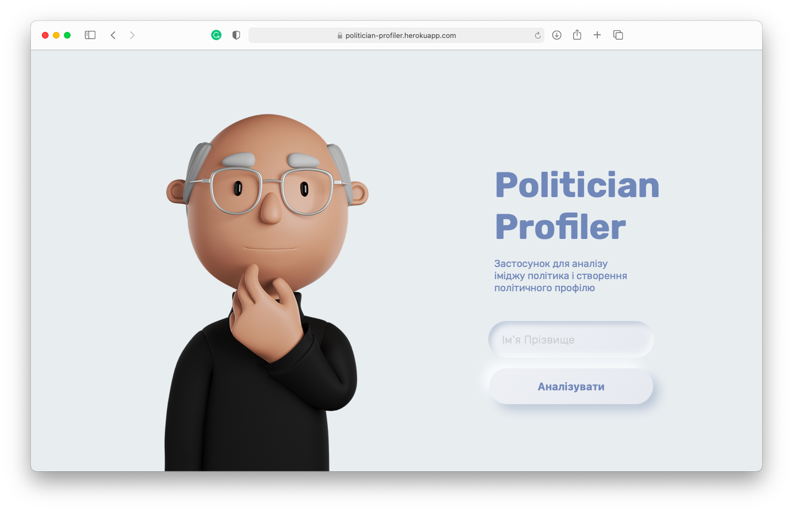
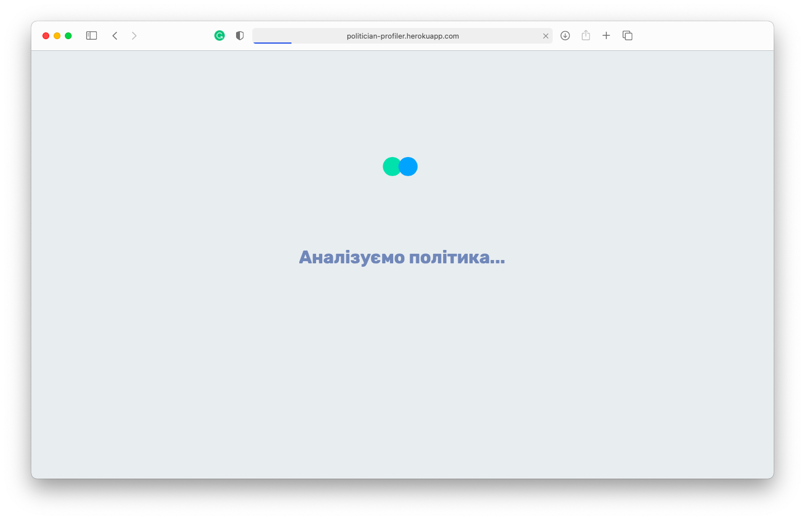
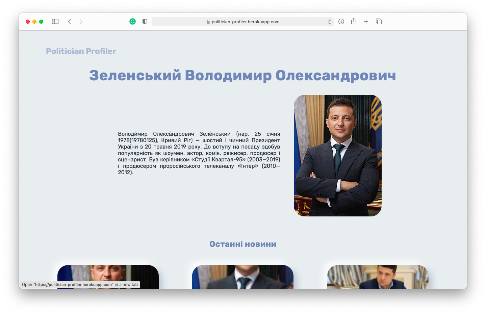
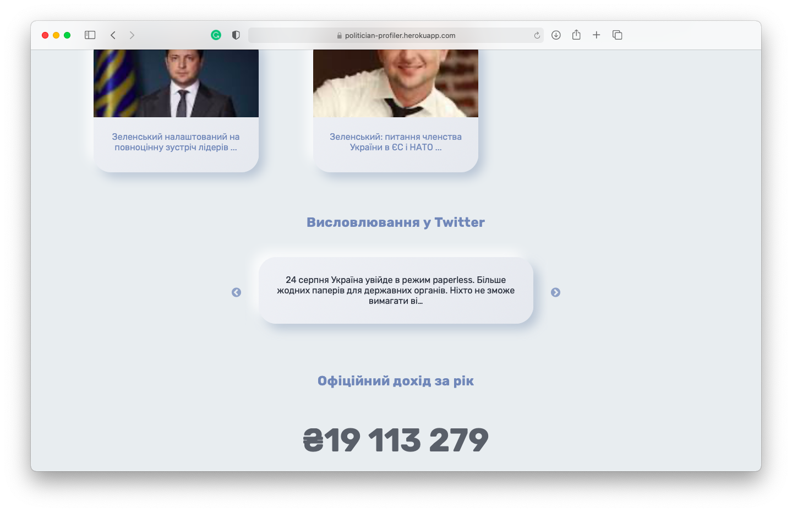
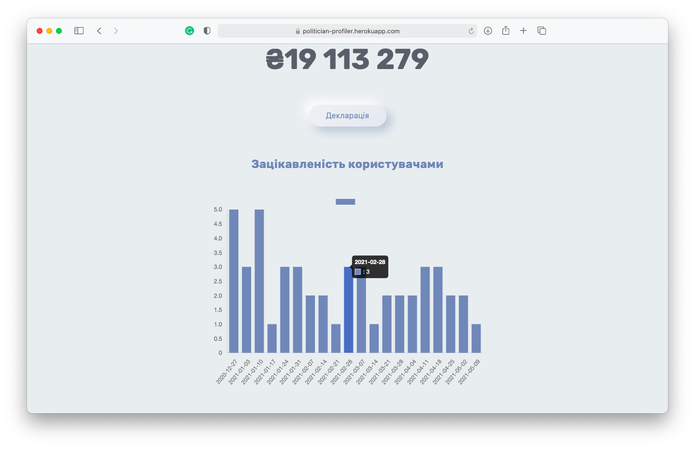
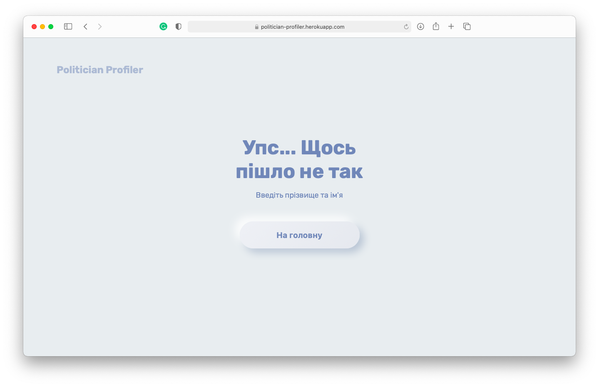
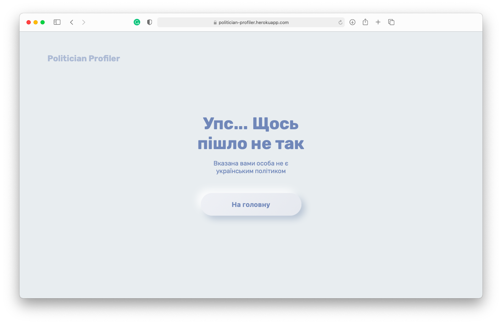

# Politician Profiler

A [website](https://politician-profiler.herokuapp.com/) for analyzing reputation of Ukrainian politicians.

## Table of contents:
* [Description](#description)
* [Visual representation](#visual_representation)
* [Wiki pages](#wiki_pages)
* [Usage](#usage)
* [Contributing](#contributing)
* [Credits](#credits)
* [License](#license)

## Description

Project is made for citizens who want to know whether ukrainian politicians are honest and commited to their work. Such problem is highly important especially in Ukraine, so the app is brought to users to help them decide who to vote for on elections and just for regular politican's reputation monitoring.

By using our website, you will:
* get short politician's bio
* be informed if the politician is buttonmasher, corrupt or absentee
* check latest news headlines related to this politician with photos
* check latest publications in Twitter
* сheck officially declarated annual income and declaration
* see bar chart representing interest in a political figure

## Visual representation

#### Start page

#### Loading page

#### Result page

#### Result page

#### Result page

#### Error page

#### Error page

#### Video presentation
[Click here](https://youtu.be/YCokSiGB-GQ)

## Wiki pages

* [Homework 0](https://github.com/iamthewalrus67/politician-profiler/wiki/Домашнє-завдання-№0)
* [Homework 1](https://github.com/iamthewalrus67/politician-profiler/wiki/Домашнє-завдання-№1)
* [Homework 2](https://github.com/iamthewalrus67/politician-profiler/wiki/Домашнє-завдання-№2)
* [Homework 3](https://github.com/iamthewalrus67/politician-profiler/wiki/Домашнє-завдання-№3)
* [Homework 4](https://github.com/iamthewalrus67/politician-profiler/wiki/Домашнє-завдання-№4)
* [Homework 5](https://github.com/iamthewalrus67/politician-profiler/wiki/Домашнє-завдання-№5)

## Usage

Follow the [link](https://politician-profiler.herokuapp.com/) or clone repository locally and run app.py. Enjoy!

## Contributing

Pull requests are welcome. For major changes, please open an issue first to discuss what you would like to change.

Or you can: 
1. Fork this repository on GitHub
2. Clone the project to your own machine
3. Commit changes to your own branch
4. Push your work back up to your forked repository
5. Create a pull request so that we can review your changes

## Credits
* Bohdan Ruban
* Roman Kulyk
* Vladyslav Vasylevych
* Vira Saliieva
* Yuliia Kryklyva

## License
[MIT](LICENSE)
